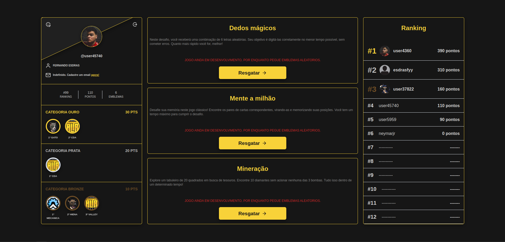
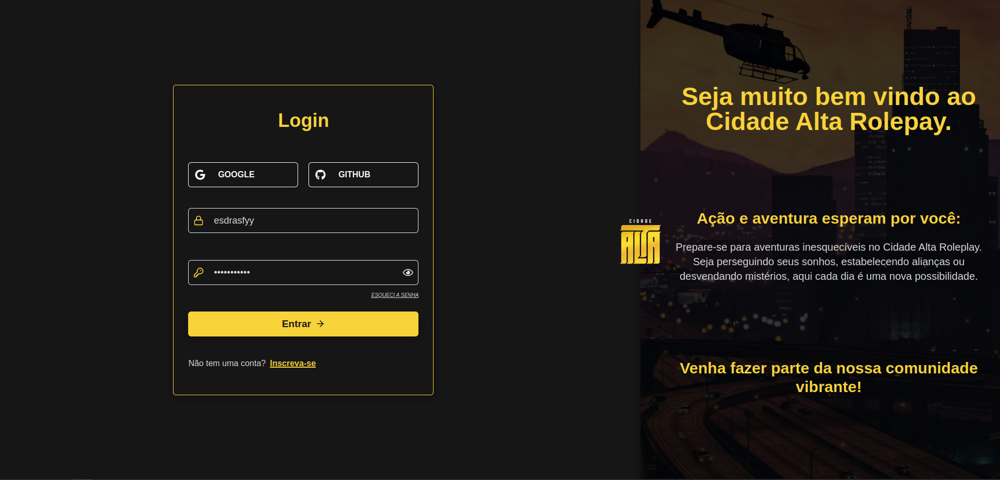

# Desafio para Vaga de Desenvolvedor FullStack na Empresa Cidade Alta





## Instalação e Inicialização do Frontend

Para iniciar o frontend do aplicativo em React, siga os passos abaixo:

### Instalação

1. Navegue até o diretório do frontend:

   ```bash
   cd frontend

   ```

2. Instale todas as dependências necessárias:

   ```bash
   npm install

   ```

3. Inicie o projeto localmente:

   ```bash
   npm start
   ```

### Build

1. Navegue até o diretório do frontend:

   ```bash
   cd frontend

   ```

2. Instale todas as dependências necessárias:

   ```bash
   npm build
   ```

---

## Configuração do `.env`

Lembre-se de configurar os arquivos .env de acordo com o .env.example fornecido para fins de teste. Os dados no .env.example são destinados apenas para uso durante o desenvolvimento e testes, pois o aplicativo ainda não está em produção.

## Inicie o backend `.env`

Lembre-se de iniciar o backend do servidor para que o frontend possa funcionar corretamente.
